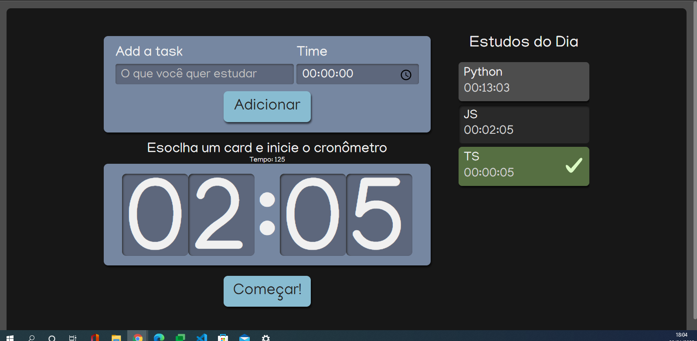

<h1>Typescript Negociation</h1>
<h2>O que é esse projeto?</h2>

Cronômetro para tarefa em lista de tarefas. Projeto desenvolvido durante curso de React com Typescript da Alura

<h2>Tecnologias usadas:</h2>
<ul>
  <li>Typescript</li>
  <li>React JS</li>
  <li>Node.js</li>
  <li>Sass</li>
  <li>CSS Modules</li>
</ul>

<h2>Front End:</h2>

  

